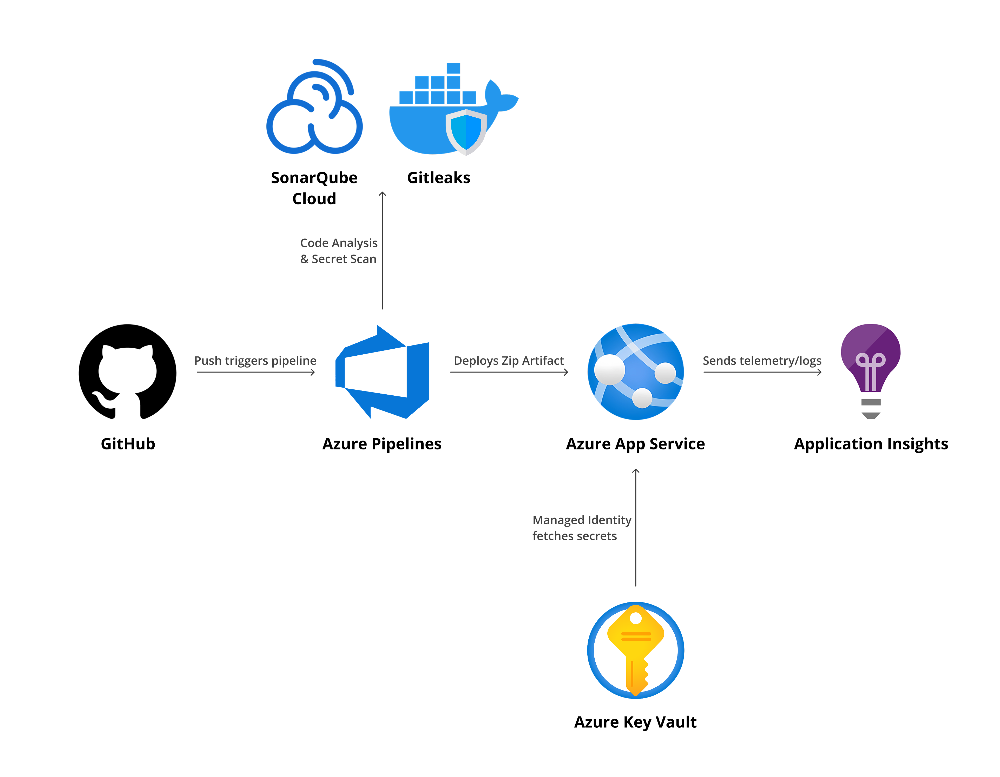
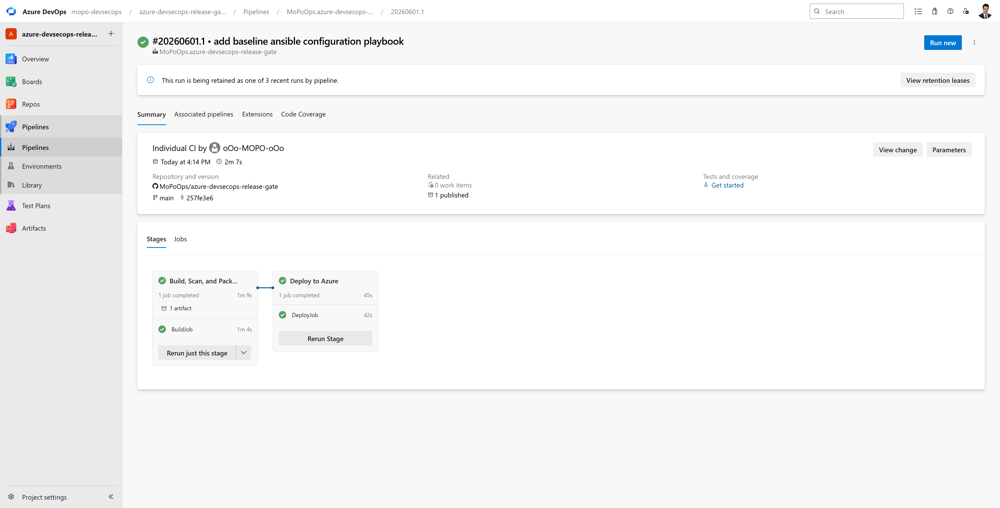
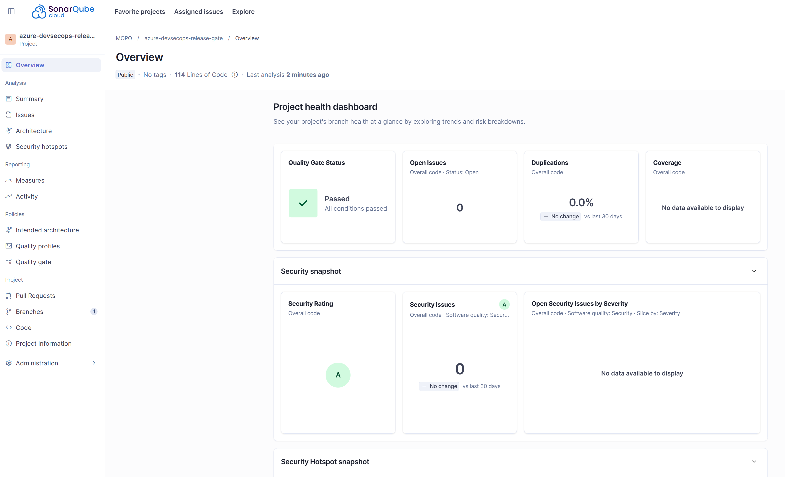
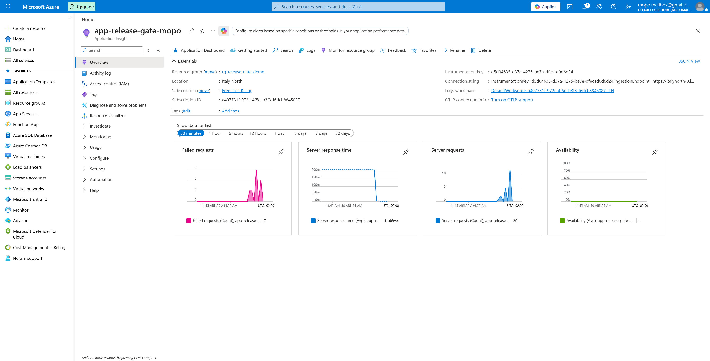
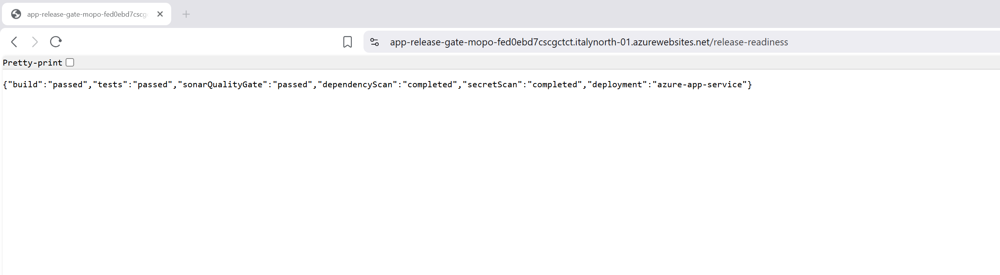

# Azure DevSecOps Release Gate

A small Azure-based DevSecOps project that demonstrates how a simple .NET API can move through a secure CI/CD flow before being deployed to Azure App Service.

The goal of the project is not to build a complex application. The goal is to show the release process around the application: build, scan, package, deploy, protect secrets, and monitor the running service.

## What this project demonstrates

- A multi-stage Azure DevOps pipeline connected to a GitHub repository.
- Automated build, package, and deployment of a .NET 8 Minimal API.
- Static code analysis with SonarQube Cloud.
- Secret scanning with Gitleaks running in a Docker container.
- Dependency vulnerability checking with the native `.NET` package scanner.
- Deployment to Azure App Service on Linux.
- Secret handling through Azure Key Vault and a System-Assigned Managed Identity.
- Runtime monitoring with Azure Application Insights.
- A small Ansible playbook to demonstrate idempotent configuration behavior.

## Architecture

## Tech stack

| Area | Tool / Service |
|---|---|
| Source control | GitHub |
| CI/CD | Azure DevOps Pipelines |
| Application | .NET 8 Minimal API |
| Hosting | Azure App Service on Linux |
| SAST / code quality | SonarQube Cloud |
| Secret scanning | Gitleaks in Docker |
| Dependency scanning | `dotnet list package --vulnerable --include-transitive` |
| Secret management | Azure Key Vault |
| Identity | System-Assigned Managed Identity |
| Monitoring | Azure Application Insights |
| Configuration management demo | Ansible |

## Application endpoints

The application exposes three simple endpoints:

| Endpoint | Purpose |
|---|---|
| `/health` | Confirms that the API is running. |
| `/release-readiness` | Returns the status of the demo release checks. |
| `/config-check` | Confirms that the app can access the Key Vault-backed secret without exposing it. |

The API is intentionally simple because this project focuses on secure delivery, not application features.

## Pipeline flow

The pipeline is triggered when code is pushed to the `main` branch.

### Build, scan, and package stage

1. Run Gitleaks to scan the repository for leaked secrets.
2. Prepare SonarQube Cloud analysis.
3. Restore .NET dependencies.
4. Run a dependency vulnerability check with `dotnet list package --vulnerable --include-transitive`.
5. Build the .NET API.
6. Run SonarQube Cloud code analysis.
7. Publish the SonarQube Cloud quality gate result.
8. Publish and zip the application.
9. Save the zipped build output as an Azure DevOps artifact.

### Deploy stage

1. Wait for the build stage to complete successfully.
2. Download the saved artifact.
3. Deploy the zip package to Azure App Service through an Azure service connection.

## Security controls

| Control | What it checks | Current behavior in this demo |
|---|---|---|
| SonarQube Cloud | Bugs, vulnerabilities, code smells, and quality gate status | Used as the main code-quality gate before deployment. |
| Gitleaks | Hardcoded passwords, tokens, API keys, and other secrets | Runs during the pipeline. In this demo it is configured in onboarding/reporting mode with `continueOnError: true`. In a stricter production setup, that line should be removed so leaked secrets block the release. |
| .NET dependency scan | Known vulnerabilities in direct and transitive NuGet packages | Runs during the build stage to make dependency risk visible in the pipeline logs. |
| Key Vault + Managed Identity | Avoids storing secrets directly in code or YAML | The App Service uses a System-Assigned Managed Identity to access a Key Vault-backed app setting. The application only checks whether the secret is reachable and never prints the secret value. |
| Application Insights | Requests, response time, failures, and basic telemetry | Used to verify that the deployed service is generating monitoring data. |

## Design decisions

### Why Azure App Service instead of a virtual machine?

Azure App Service is a Platform as a Service option. It allows the project to focus on pipeline, security, deployment, and monitoring instead of operating system patching, web server installation, and low-level infrastructure maintenance.

### Why Key Vault and Managed Identity?

Hardcoding secrets in source code, pipeline YAML, or normal configuration files is unsafe. Key Vault stores the secret separately, and Managed Identity gives the App Service a passwordless identity that can be granted only the access it needs.

### Why keep the application simple?

A complex application would distract from the real purpose of the project. The API acts as the deployable workload, while the main value is in the DevSecOps flow around it.

### Why include Ansible?

The Ansible playbook is a small local demonstration of idempotency. Running the playbook once creates the desired file; running it again should not create unnecessary changes if the file is already correct.

## Evidence of execution

### 1. Azure DevOps multi-stage pipeline

### 2. SonarQube Cloud quality gate

### 3. Application Insights telemetry

### 4. Live API deployment

## Future production improvements

This project is a focused portfolio demo. In a production environment, I would add:

- Infrastructure as Code for Azure resources using Bicep or Terraform.
- Pull request validation and branch policies before merging to `main`.
- Separate dev, staging, and production environments.
- Manual approval before production deployment.
- Azure App Service deployment slots for safer releases.
- Strict Gitleaks blocking by removing `continueOnError: true`.
- More advanced dependency vulnerability thresholds.
- Azure Defender for Cloud or GitHub Advanced Security integration.
- Web Application Firewall and stronger network restrictions.
- Cost alerts, tagging, and cleanup automation.